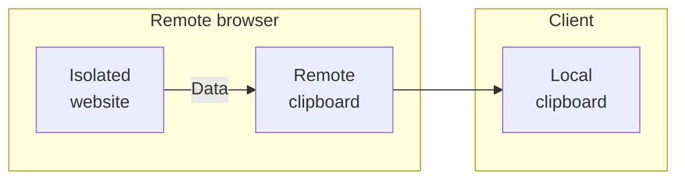
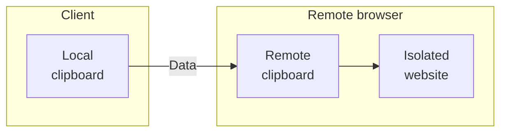

import { Render, Tabs, TabItem } from "~/components";

With Browser Isolation, you can define policies to dynamically isolate websites based on identity, security threats, or content.

## Isolate

When an HTTP policy applies the Isolate action, the user's web browser is transparently served an HTML compatible remote browser client. Isolation policies can be applied to requests that include `Accept: text/html*`. This allows Browser Isolation policies to co-exist with API traffic.

The following example enables isolation for all web traffic:

| Selector | Operator      | Value | Action  |
| -------- | ------------- | ----- | ------- |
| Host     | matches regex | `.*`  | Isolate |

If instead you need to isolate specific pages, you can list the domains for which you would like to isolate traffic:

| Selector | Operator | Value                        | Action  |
| -------- | -------- | ---------------------------- | ------- |
| Domain   | In       | `example.com`, `example.net` | Isolate |

:::note[Isolate identity providers for applications]

Existing cookies and sessions from non-isolated browsing are not sent to the remote browser. Websites that implement single sign-on using third-party cookies will also need to be isolated.

For example, if `example.com` authenticates using Google Workspace, you will also need to isolate the top level [Google Workspace URLs](https://support.google.com/a/answer/9012184).

:::

## Do Not Isolate

You can choose to disable isolation for certain destinations or categories. The following configuration disables isolation for traffic directed to `example.com`:

| Selector | Operator | Value         | Action         |
| -------- | -------- | ------------- | -------------- |
| Host     | In       | `example.com` | Do Not Isolate |

## Policy settings

The following optional settings appear in the Gateway HTTP policy builder when you select the _Isolate_ action. Configure these settings to [prevent data loss](https://blog.cloudflare.com/data-protection-browser/) when users interact with untrusted websites in the remote browser.

### Copy (from remote to client)



- _Allow_: (Default) Users can copy content from an isolated website to their local clipboard.
- _Allow only within isolated browser_: Users can only copy content from an isolated website to the remote clipboard. Users cannot copy content out of the remote browser to the local clipboard. You can use this setting alongside [**Paste (from client to remote)**: _Allow only within isolated browser_](/cloudflare-one/policies/browser-isolation/isolation-policies/#paste-from-client-to-remote) to only allow copy-pasting between isolated websites.
- _Do not allow_: Prohibits users from copying content from an isolated website.

### Paste (from client to remote)



- _Allow_: (Default) Users can paste content from their local clipboard to an isolated website.
- _Allow only within isolated browser_: Users can only paste content from the remote clipboard to an isolated website. Users cannot paste content from their local clipboard to the remote browser. You can use this setting alongside [**Copy (from remote to client)**: _Allow only within isolated browser_](/cloudflare-one/policies/browser-isolation/isolation-policies/#copy-from-remote-to-client) to only allow copy-pasting between isolated websites.
- _Do not allow_: Prohibits users from pasting content into an isolated website.

### File downloads

- _Allow_: (Default) User can download files from an isolated website to their local machine.
- _Do not allow_: Prohibits users from downloading files from an isolated website to their local machine.

:::note
This option does not prevent files from being downloaded into the remote browser. To prevent files being downloaded into the remote browser, use HTTP Policies to block by [Download Mime Type](/cloudflare-one/policies/gateway/http-policies/#download-and-upload-mime-type).
:::

### File uploads

- _Allow_: (Default) Users can upload files from their local machine into an isolated website.
- _Do not allow_: Prohibits users from uploading files from their local machine into an isolated website.

:::note
This option does not prevent files being uploaded to websites from third-party cloud file managers or files downloaded into the remote browser download bar from other isolated websites. To prevent files being uploaded from the remote browser into an isolated website, use HTTP Policies to block by [Upload Mime Type](/cloudflare-one/policies/gateway/http-policies/#download-and-upload-mime-type).
:::

### Keyboard

- _Allow_: (Default) Users can perform keyboard inputs into an isolated website.
- _Do not allow_: Prohibits users from performing keyboard inputs into an isolated website.

:::note
Mouse input remains available to allow users to browse a website by following hyperlinks and scrolling. This does not prevent user input into third-party virtual keyboards within an isolated website.
:::

### Printing

- _Allow_: (Default) Users can print isolated web pages to their local machine.
- _Do not allow_: Prohibits users from printing isolated web pages to their local machine.

## Common policies

### Isolate all security threats

Isolate security threats such as malware and phishing.

<Tabs syncKey="dashPlusAPI"> <TabItem label="Dashboard">

| Selector            | Operator | Value                | Action  |
| ------------------- | -------- | -------------------- | ------- |
| Security Categories | in       | _All security risks_ | Isolate |

</TabItem>

<TabItem label="API">

```bash
curl https://api.cloudflare.com/client/v4/accounts/{account_id}/gateway/rule \
--header "Content-Type: application/json" \
--header "Authorization: Bearer <API_TOKEN>" \
--data '{
  "name": "Isolate all security threats",
  "description": "Isolate security threats such as malware and phishing",
  "enabled": true,
  "action": "isolate",
  "filters": [
    "http"
  ],
  "traffic": "any(http.request.uri.security_category[*] in {68 178 80 83 176 175 117 131 134 151 153})",
  "identity": "",
  "device_posture": ""
}'
```

</TabItem> </Tabs>

### Isolate high risk content

Isolate high risk content categories such as newly registered domains.

<Tabs syncKey="dashPlusAPI"> <TabItem label="Dashboard">

| Selector           | Operator | Value            | Action  |
| ------------------ | -------- | ---------------- | ------- |
| Content Categories | in       | _Security Risks_ | Isolate |

</TabItem>

<TabItem label="API">

```bash
curl https://api.cloudflare.com/client/v4/accounts/{account_id}/gateway/rule \
--header "Content-Type: application/json" \
--header "Authorization: Bearer <API_TOKEN>" \
--data '{
  "name": "Isolate high risk content",
  "description": "Isolate high risk content categories such as newly registered domains",
  "enabled": true,
  "action": "isolate",
  "filters": [
    "http"
  ],
  "traffic": "any(http.request.uri.content_category[*] in {32 169 177 128})",
  "identity": "",
  "device_posture": ""
}'
```

</TabItem> </Tabs>

### Isolate news and media

Isolate news and media sites, which are targets for malvertising attacks.

<Tabs syncKey="dashPlusAPI"> <TabItem label="Dashboard">

| Selector           | Operator | Value            | Action  |
| ------------------ | -------- | ---------------- | ------- |
| Content Categories | in       | _News and Media_ | Isolate |

</TabItem>

<TabItem label="API">

```bash
curl https://api.cloudflare.com/client/v4/accounts/{account_id}/gateway/rule \
--header "Content-Type: application/json" \
--header "Authorization: Bearer <API_TOKEN>" \
--data '{
  "name": "Isolate news and media",
  "description": "Isolate news and media sites, which are targets for malvertising attacks",
  "enabled": true,
  "action": "isolate",
  "filters": [
    "http"
  ],
  "traffic": "any(http.request.uri.content_category[*] in {122})",
  "identity": "",
  "device_posture": ""
}'
```

</TabItem> </Tabs>

### Isolate uncategorized content

Isolate content that has not been categorized by [Cloudflare Radar](/radar/).

<Tabs syncKey="dashPlusAPI"> <TabItem label="Dashboard">

| Selector           | Operator | Value                    | Action  |
| ------------------ | -------- | ------------------------ | ------- |
| Content Categories | not in   | _All content categories_ | Isolate |

</TabItem>

<TabItem label="API">

```bash
curl https://api.cloudflare.com/client/v4/accounts/{account_id}/gateway/rule \
--header "Content-Type: application/json" \
--header "Authorization: Bearer <API_TOKEN>" \
--data '{
  "name": "Isolate uncategorized content",
  "description": "Isolate content not categorized by Cloudflare Radar",
  "enabled": true,
  "action": "isolate",
  "filters": [
    "http"
  ],
  "traffic": "not(any(http.request.uri.content_category[*] in {2 67 125 133 3 75 183 89 182 6 90 91 144 150 7 70 74 76 79 92 96 100 106 107 116 120 121 122 127 139 156 164 99 9 101 137 10 103 146 11 12 77 98 108 110 111 118 126 129 172 168 113 33 179 166 15 115 119 124 141 161 17 85 87 102 157 135 138 180 162 140 142 32 169 177 128 22 73 82 88 148 23 24 181 71 72 173 78 84 86 94 97 104 105 114 174 93 130 132 136 147 149 154 158 152 26 69 184 81 95 109 123 145 155 159 160 163 165 167}))",
  "identity": "",
  "device_posture": ""
}'
```

</TabItem> </Tabs>

### Isolate ChatGPT

Isolate the use of ChatGPT.

<Tabs syncKey="dashPlusAPI"> <TabItem label="Dashboard">

| Selector    | Operator | Value     | Action  |
| ----------- | -------- | --------- | ------- |
| Application | in       | _ChatGPT_ | Isolate |

In **Configure policy settings**, you can customize restrictions for ChatGPT. For example, to prevent your users from inputting sensitive information, you can select **Disable copy / paste** and **Disable file uploads**.

</TabItem>

<TabItem label="API">

```bash
curl https://api.cloudflare.com/client/v4/accounts/{account_id}/gateway/rule \
--header "Content-Type: application/json" \
--header "Authorization: Bearer <API_TOKEN>" \
--data '{
  "name": "Isolate ChatGPT",
  "description": "Isolate the use of ChatGPT",
  "enabled": true,
  "action": "isolate",
  "filters": [
    "http"
  ],
  "traffic": "any(app.ids[*] in {1199})",
  "identity": "",
  "device_posture": ""
}'
```

</TabItem> </Tabs>
