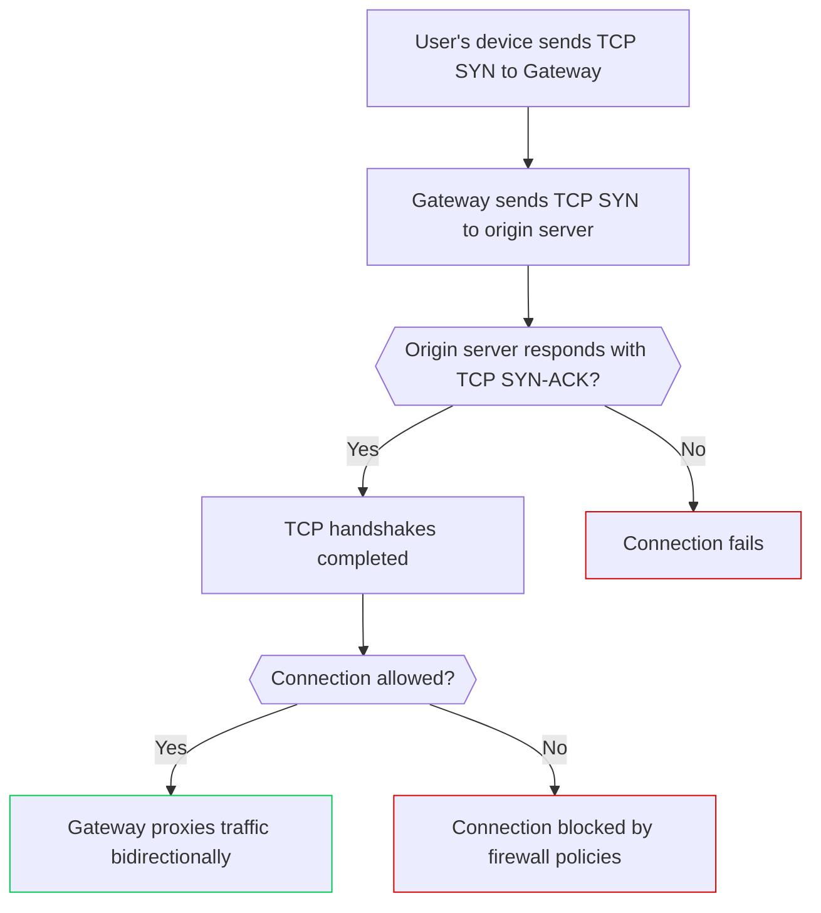

import { Badge } from "~/components";

You can forward [HTTP](/cloudflare-one/policies/gateway/initial-setup/http/) and [network](/cloudflare-one/policies/gateway/initial-setup/network/) traffic to Gateway for logging and filtering. Gateway can proxy both outbound traffic and traffic directed to resources connected via a Cloudflare Tunnel, GRE tunnel, or IPsec tunnel.

The Gateway proxy is required for filtering HTTP and network traffic via the WARP client in Gateway with WARP mode. To proxy HTTP traffic without deploying the WARP client, you can configure [PAC files](/cloudflare-one/connections/connect-devices/agentless/pac-files/) on your devices.

## Proxy algorithm

Gateway uses the [Happy Eyeballs algorithm](https://datatracker.ietf.org/doc/html/rfc6555) to proxy traffic in the following order:

1. The user's browser initiates the TCP handshake by sending Gateway a TCP SYN segment.
2. Gateway sends a SYN segment to the origin server.
3. If the origin server sends a SYN-ACK segment back, Gateway establishes distinct TCP connections between the user and Gateway and between Gateway and the origin server.
4. Gateway inspects and filters traffic received from the user.
5. If the traffic passes inspection, Gateway proxies traffic bidirectionally between the user and the origin server.

## Supported protocols

Gateway supports proxying TCP, UDP, and ICMP traffic.

### TCP

When the proxy is enabled, Gateway will always forward TCP traffic.

By default, TCP connection attempts will timeout after 30 seconds and idle connections will disconnect after 8 hours.

### UDP

The UDP proxy forwards UDP traffic such as VoIP, [internal DNS requests](/cloudflare-one/connections/connect-networks/private-net/cloudflared/private-dns/), and thick client applications.

When the UDP proxy is enabled, Gateway will force all HTTP/3 traffic to HTTP/2 to allow inspection. Otherwise, HTTP/3 traffic will bypass inspection. For more information, refer to [HTTP/3 inspection](/cloudflare-one/policies/gateway/http-policies/http3/).

### ICMP <Badge text="Beta" variant="caution" size="small" />

The ICMP proxy forwards traffic for diagnostic tools such as `ping` and `traceroute`.

:::caution[Limitation]
Gateway cannot log or filter ICMP traffic.
:::

## Turn on the Gateway proxy

1. In [Zero Trust](https://one.dash.cloudflare.com), go to **Settings** > **Network**.
2. In **Firewall**, turn on **Proxy**.
3. Select **TCP**.
4. (Optional) Depending on your use case, you can select **UDP** and/or **ICMP**.
